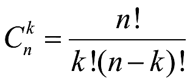
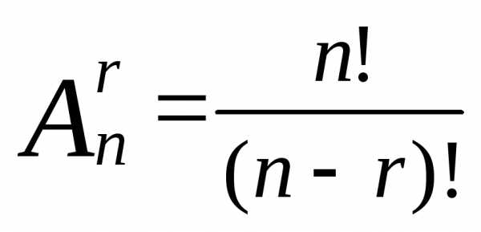
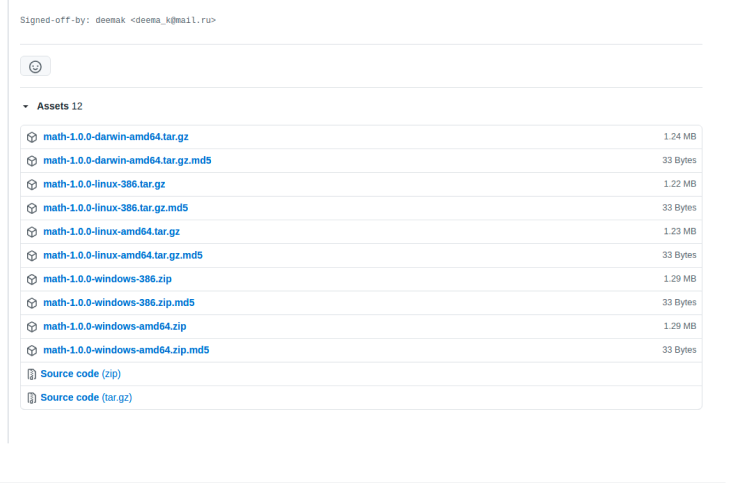
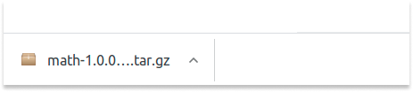
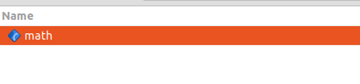
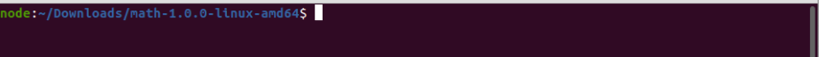
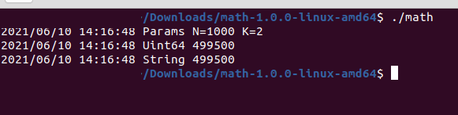
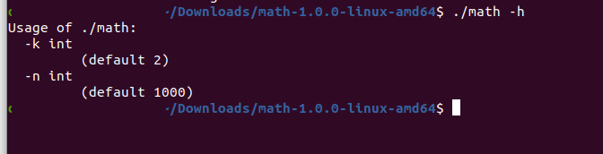

# Mathematical and algorithms experiments 

<p></p>

# Intro
[](https://godoc.org/github.com/digital-technology-agency/math)
[](https://github.com/digital-technology-agency/math/actions/workflows/go.yml)
[](https://goreportcard.com/report/github.com/digital-technology-agency/math)
[](LICENSE)
[](https://dta.agency)
[](https://github.com/digital-technology-agency/math/releases/latest)


<p>&nbsp;</p>


## Menu
`Sorted`
* [Sort insertion](https://github.com/digital-technology-agency/math/wiki/Sort-insertion)
* [Merge sort](https://github.com/digital-technology-agency/math/wiki/Merge-sort)

`Mathematical`

* [C from n to k](https://github.com/digital-technology-agency/math/wiki/C-from-n-to-k)
* [Factorial](https://github.com/digital-technology-agency/math/wiki/Factorial)
* [Permutation](https://github.com/digital-technology-agency/math/wiki/Permutation)
* [Placements](https://github.com/digital-technology-agency/math/wiki/Placements)


## Examples

### C from n to k



Let there be **n** different objects. To find the number of combinations of **n** objects by **k**, we will choose combinations of **m** objects in all possible ways, while paying attention to the different composition of the combinations, but not the order (it is not important here, unlike the placements).

### Factorial 


The factorial operation is encountered in many areas of mathematics, notably in combinatorics, algebra, and mathematical analysis. Its most basic use counts the possible distinct sequences – the permutations – of **n** distinct objects: there are **n!**.

### Permutations (n)

### _**Pn** = **n!**_

Permutations differ from combinations, which are selections of some members of a set regardless of order. For example, written as tuples, there are six permutations of the set {1,2,3}, namely: (1,2,3), (1,3,2), (2,1,3), (2,3,1), (3,1,2), and (3,2,1). These are all the possible orderings of this three-element set. Anagrams of words whose letters are different are also permutations: the letters are already ordered in the original word, and the anagram is a reordering of the letters. The study of permutations of finite sets is an important topic in the fields of combinatorics and group theory.


### Placements (n)



If you are already familiar with combinations, then you will easily notice that in order to find placements, you need to take all possible combinations, and then change the order in each one in all possible ways (that is, in fact, make more **permutations**). Therefore, the number of placements is also expressed in terms of the number of permutations and combinations


### Issues
[](https://github.com/digital-technology-agency/math/issues?q=is%3Aopen+is%3Aissue)
[](https://github.com/digital-technology-agency/math/issues?q=is%3Aissue+is%3Aclosed)


## Usage
### [golang/cmd/go](https://golang.org/cmd/go/)

```bash
go get github.com/digital-technology-agency/math/pkg/combinatorics
```

## Test

```bash
go test -run ''
```


## Quickstart

**C from n to k**

```go

import "github.com/digital-technology-agency/math/pkg/combinatorics"

func Example() {
    n := 100
    k := 3
    value := combinatorics.CnkUint(n, k)
	fmt.Printf("Result: %d", value)
    /*
        Result: 161700    
    */ 
}
```

**Factorial (n!)**

```go

import "github.com/digital-technology-agency/math/pkg/combinatorics"

func Example() {
    n := 4
    value := combinatorics.FactorialInt(n)
	fmt.Printf("Result: %d", value)
    /*
        Result: 24    
    */ 
}
```

**Permutations (n)**

```go

import "github.com/digital-technology-agency/math/pkg/combinatorics"

func Example() {
    n := 4
    value := combinatorics.PermutationsInt(n)
	fmt.Printf("Result: %d", value)
    /*
        Result: 24    
    */ 
}
```

**Placements (A from n to k)**

```go

import "github.com/digital-technology-agency/math/pkg/combinatorics"

func Example() {
    n := 10
    k := 10
    value := combinatorics.PlacementInt(n,k)
	fmt.Printf("Result: %d", value)
    /*
        Result: 3628800    
    */ 
}
```

## Run in Terminal

* Go to main page and click **Releases**


* Choose a version for your operating system and click the link



* Download and unzip the **math** file




* Open terminal in unzip folder
 


* Run unzip binary file  **math** and show list **types**

```bash
 ./math
```



* Comand argument list 

```bash
 ./math -h
```



* Set arguments
```bash
 ./math -n=10000 -k=10
```

## Contributing
Pull requests and Github issues are welcome.  Please read our [contributing guide](./CONTRIBUTING.md) for more information.

[Агентство цифровых технологий](https://dta.agency/)
